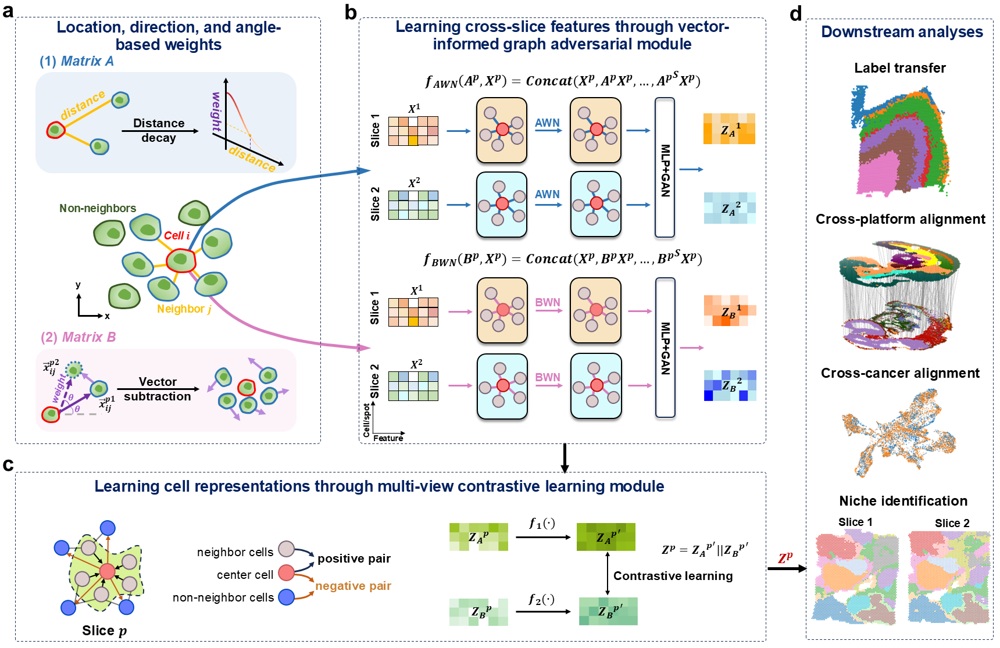

# stLVG: Spatio-Temporal Lightweight Vector-guided Graph Network

This repository contains the basic code and examples for stLVG, a novel vector-driven graph neural network for spatial multi-slice multi-omics integration.
## Installation
We provide **two simple methods** to set up the environment on **MacOS, Windows, and Linux**.

## Method 1: One-Click Installation (Recommended)

### Step 1, Clone the repository
```bash
git clone https://github.com/YikaiLou/stLVG.git
cd stLVG
```

### Step 2, Create and activate environment (automatically installs all dependencies)
```bash
conda env create -f environment.yml
conda activate stLVG
```

## Method 2: Manual Installation
If you need more control over dependencies, or if Method 1 fails due to platform-specific issues, follow these steps:

### Step 1, Clone the repository
```bash
git clone https://github.com/YikaiLou/stLVG.git
cd stLVG
```

### Step 2, Create conda environment
```bash
conda create -n stLVG python=3.8
conda activate stLVG
```

### Step 3, Install PyTorch (choose based on your platform)
```bash
# MacOS / CPU-only:
conda install pytorch=2.2.1 -c pytorch

# Linux/Windows with NVIDIA GPU:
# conda install pytorch=2.2.1 pytorch-cuda=11.8 -c pytorch -c nvidia
```

### Step 4, Install the project and all dependencies
```bash
pip install -e .
```

## License
This project is licensed under the [MIT License](LICENSE).